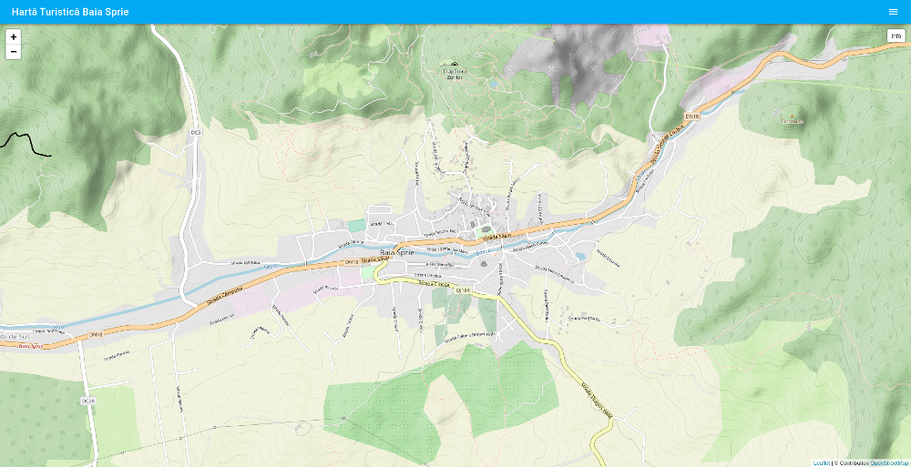

# haiafara.ro

"Hai afară!" ("Come outside!" in Romanian) is a Ruby on Rails application used to showcase hiking, biking and running trails as well as other types of tourist attractions in a given zone of interest.

## Setup

### Convert a user to admin

Register a user the usual way and then run:

1. Locally:

        rails users:make_admin[user@email.com]

2. On your deployed instance via Capistrano:

        cap production users:make_admin[user@email.com]

## Uses the following libaries / frameworks

*   [Tailwind CSS](https://tailwindcss.com/)
*   [Leaflet](https://leafletjs.com/)
*   [Leaflet.fullscreen](https://github.com/Leaflet/Leaflet.fullscreen)
*   [Leaflet-active-area](https://github.com/Mappy/Leaflet-active-area)
*   [CSS Element Queries](https://github.com/marcj/css-element-queries)
*   [vue-it-bigger](https://github.com/haiafara/vue-it-bigger)

## License

This project is licensed under the the [Apache License, Version 2.0](http://www.apache.org/licenses/LICENSE-2.0).
